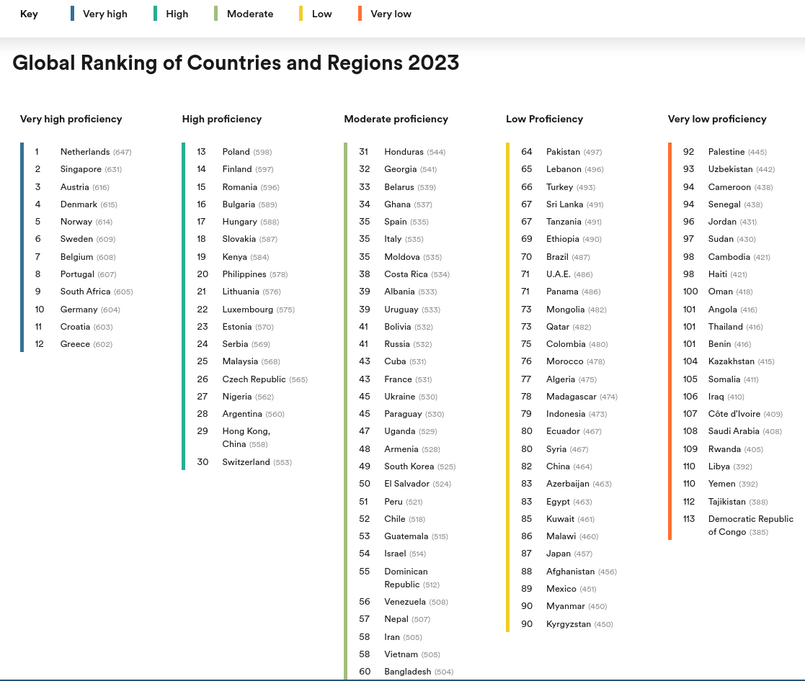
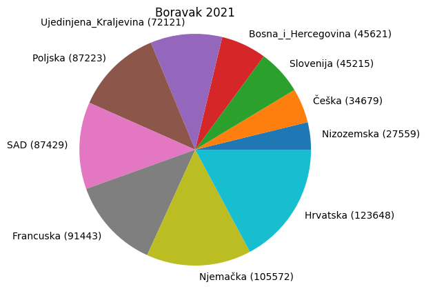
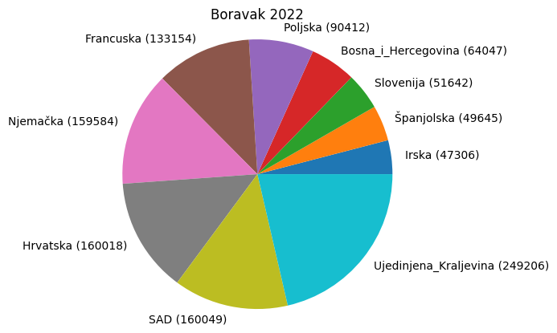
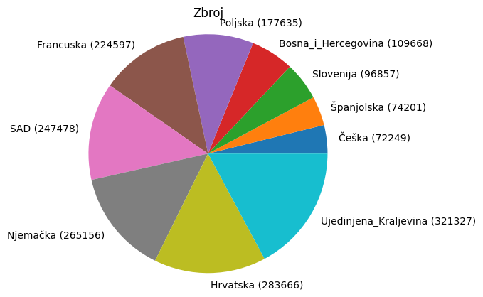
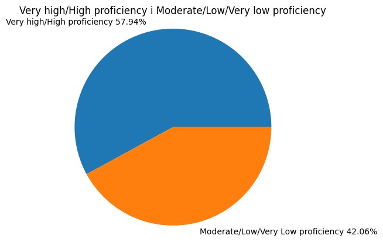

# Kratka analiza govornih vještina Engleskog jezika turista 2022. i 2021. godine (za Dubrovnik)

Primarna funkcija ovog kratkog rada je bila da mi pomogne odrediti kompleksnost govora kojeg ću koristiti prilikom opisivanja apartmana na booking stranicama.

Logično je da govor treba biti što jednostavniji. Na taj način je oglas inkluzivniji. Želja je privući što veći broj korisnika. Također čitanjem kompliciranog teksta korisnik može izgubiti strpljenje i odabrati neki drugi apartman.
 
### Pitanje koje me zanima: Je li u Hrvatsku (u ovom slučaju se gleda Dubrovnik), većinom, dolaze gosti koji Engleski govore izvrsno? 

Ako da, onda je, možda, dobro koristiti kompleksniji (lirski) govor kao sredstvo oglašavanja. 

Opis apartmana je samo jedna mala komponenta iznajmljivanja, ali kao i u svakom poslu bitno je obratiti pozornost na detalje. 

### Podaci o razumijevanju Engleskoga jezika su preuzeti od EF EPI (EF English Proficiency Index):
#### ideja je analizirati koliki postotak gostiju dolazi iz zemalja s "Very high proficiency" ili "High proficiency" rezultatom.



### Napisao sam opis apartmana ali nisam mogao odrediti u koju kategoriju EPI-a spada.
#### Odgovor sam dobio tako da sam svoj opis proslijedio ljudima u mojoj okolini. 
#### S obzirom na to da je Hrvatska na listi "Very high proficiency", komentar na tekst mi može dati sliku o njegovoj kompleksnosti.
#### Neki od komentara:
- "Jako lijepo"
- "Kako si ovo super napiso"
- "Ja ništa ne razumijem"
- "Uff kako si ga složio"
- ...
#### To je prosjek komentara 2 pozitivna, 1 jako negativan i 1 negativan.
#### Odlučio sam smanjiti kompleksnost teksta.
#### Novi komentari su bili uglavnom pozitivni.

Podaci o noćenjima su preuzeti sa stranice Hrvatske turističke zajednice.


```python
f = open("pom.txt","r")
lista=[]

```

### Učitavamo podatke iz .txt po redcima:


```python
i = f.readline()
while i:
    i=i.strip()
    lista.append(i)
    i=f.readline()
    
f.close()
print(lista)
```

    ['Ujedinjena_Kraljevina 249.206 72.121 345,54 1.286.305 390.575 329,34', 'Njemačka 159.584 105.572 151,16 739.244 604.222 122,35', 'Hrvatska 160.018 123.648 129,41 603.472 527.931 114,31', 'Poljska 90.412 87.223 103,66 594.179 602.456 98,63', 'Francuska 133.154 91.443 145,61 469.211 324.931 144,40', 'SAD 160.049 87.429 183,06 463.498 268.578 172,57', 'Bosna_i_Hercegovina 64.047 45.621 140,39 407.030 349.442 116,48', 'Slovenija 51.642 45.215 114,21 386.982 373.343 103,65', 'Češka 37.570 34.679 108,34 288.939 272.242 106,13', 'Irska 47.306 7.932 596,39 222.947 39.247 568,06', 'Austrija 34.771 25.535 136,17 169.744 144.116 117,78', 'Italija 43.015 18.381 234,02 157.718 78.300 201,43', 'Nizozemska 38.334 27.559 139,10 148.660 110.289 134,79', 'Srbija 17.424 12.370 140,86 132.942 114.197 116,41', 'Španjolska 49.645 24.556 202,17 124.606 62.719 198,67', 'Norveška 23.159 2.492 929,33 122.518 14.393 851,23', 'Mađarska 17.920 15.675 114,32 105.663 95.509 110,63', 'Slovačka 14.122 10.565 133,67 93.919 76.810 122,27', 'Finska 18.568 2.654 699,62 89.940 11.897 755,99', 'Kanada 26.650 5.326 500,38 87.963 22.455 391,73', 'Švedska 18.338 7.919 231,57 86.369 41.011 210,60', 'Belgija 22.370 15.336 145,87 84.575 65.507 129,11', 'Ukrajina 12.748 14.267 89,35 79.916 80.970 98,70', 'Švicarska 20.968 14.539 144,22 76.657 59.101 129,71', 'Australija 21.709 2.830 767,10 65.309 11.490 568,40', 'Danska 12.538 6.737 186,11 59.753 33.701 177,30', 'Rumunjska 13.643 10.198 133,78 53.336 43.943 121,38', 'Ostale_azijske_zemlje 12.110 3.190 379,62 35.965 11.780 305,31', 'Rusija 6.600 24.786 26,63 33.067 139.013 23,79', 'Litva 8.284 4.179 198,23 31.634 18.288 172,98', 'Brazil 10.940 2.285 478,77 30.875 8.733 353,54', 'Ostale_zemlje_Južne_i_Srednje_Amerike 10.557 4.097 257,68 29.359 13.520 217,15', 'Makedonija 4.435 2.568 172,70 28.078 19.884 141,21', 'Portugal 9.790 4.323 226,46 26.823 12.232 219,29', 'Grčka 9.257 2.080 445,05 25.518 6.100 418,33', 'Koreja,_Republika 7.954 1.045 761,15 21.243 2.774 765,79', 'Albanija 9.133 3.669 248,92 19.895 11.540 172,40', 'Argentina 7.457 1.279 583,03 19.879 4.816 412,77', 'Indija 7.127 2.145 332,26 18.215 6.357 286,53', 'Kina 6.784 2.382 284,80 17.503 8.382 208,82', 'Crna_Gora 5.103 2.290 222,84 17.133 9.507 180,21', 'Meksiko 6.608 2.444 270,38 16.408 6.572 249,67', 'Letonija 3.448 2.433 141,72 14.086 10.907 129,15', 'Estonija 2.935 1.812 161,98 12.893 8.333 154,72', 'Turska 4.555 2.068 220,26 12.353 7.362 167,79', 'Japan 4.308 1.516 284,17 11.959 4.795 249,41', 'Bugarska 3.884 1.825 212,82 11.605 6.522 177,94', 'Novi_Zeland 3.809 710 536,48 10.941 3.319 329,65', 'Čile 3.884 984 394,72 10.473 3.547 295,26', 'Izrael 4.145 2.055 201,70 10.412 6.700 155,40', 'Južnoafrička_Republika 3.329 778 427,89 10.147 4.345 233,53', 'Kosovo 3.428 1.899 180,52 9.111 5.646 161,37', 'Ostale_afričke_zemlje 2.418 1.419 170,40 8.405 5.408 155,42', 'Ostale_europske_zemlje 1.466 944 155,30 6.825 4.786 142,60', 'Island 1.832 276 663,77 6.774 1.077 628,97', 'Luksemburg 1.291 1.059 121,91 5.850 5.207 112,35', 'Bjelorusija 1.013 450 225,11 4.856 2.368 205,07', 'Maroko 1.109 576 192,53 3.428 1.767 194,00', 'Ostale_zemlje_Sjeverne_Amerike 677 374 181,02 2.358 1.576 149,62', 'Cipar 809 262 308,78 2.312 866 266,97', 'Tajland 932 206 452,43 2.308 854 270,26', 'Ujedinjeni_Arapski_Emirati 928 373 248,79 2.301 1.178 195,33', 'Tajvan,_Kina 872 126 692,06 2.038 396 514,65', 'Malta 656 293 223,89 1.822 1.020 178,63', 'Kazahstan 385 299 128,76 1.601 1.531 104,57', 'Tunis 492 464 106,03 1.480 1.470 100,68', 'Indonezija 539 244 220,90 1.286 1.007 127,71', 'Hong_Kong,_Kina 436 118 369,49 1.179 329 358,36', 'Kuvajt 410 249 164,66 1.071 742 144,34', 'Ostale_zemlje_Oceanije 232 277 83,75 873 938 93,07', 'Jordan 162 65 249,23 452 232 194,83', 'Katar 140 119 117,65 403 474 85,02', 'Lihtenštajn 74 45 164,44 250 107 233,64', 'Oman 72 45 160,00 187 112 166,96', 'Makao 10 6 166,67 41 19 215,79']


### Odvajamo podatke o državama u elemente liste:


```python
pom=[]
for i in lista:
    i=i.split(" ")
    pom.append(i)
print(pom)
```

    [['Ujedinjena_Kraljevina', '249.206', '72.121', '345,54', '1.286.305', '390.575', '329,34'], ['Njemačka', '159.584', '105.572', '151,16', '739.244', '604.222', '122,35'], ['Hrvatska', '160.018', '123.648', '129,41', '603.472', '527.931', '114,31'], ['Poljska', '90.412', '87.223', '103,66', '594.179', '602.456', '98,63'], ['Francuska', '133.154', '91.443', '145,61', '469.211', '324.931', '144,40'], ['SAD', '160.049', '87.429', '183,06', '463.498', '268.578', '172,57'], ['Bosna_i_Hercegovina', '64.047', '45.621', '140,39', '407.030', '349.442', '116,48'], ['Slovenija', '51.642', '45.215', '114,21', '386.982', '373.343', '103,65'], ['Češka', '37.570', '34.679', '108,34', '288.939', '272.242', '106,13'], ['Irska', '47.306', '7.932', '596,39', '222.947', '39.247', '568,06'], ['Austrija', '34.771', '25.535', '136,17', '169.744', '144.116', '117,78'], ['Italija', '43.015', '18.381', '234,02', '157.718', '78.300', '201,43'], ['Nizozemska', '38.334', '27.559', '139,10', '148.660', '110.289', '134,79'], ['Srbija', '17.424', '12.370', '140,86', '132.942', '114.197', '116,41'], ['Španjolska', '49.645', '24.556', '202,17', '124.606', '62.719', '198,67'], ['Norveška', '23.159', '2.492', '929,33', '122.518', '14.393', '851,23'], ['Mađarska', '17.920', '15.675', '114,32', '105.663', '95.509', '110,63'], ['Slovačka', '14.122', '10.565', '133,67', '93.919', '76.810', '122,27'], ['Finska', '18.568', '2.654', '699,62', '89.940', '11.897', '755,99'], ['Kanada', '26.650', '5.326', '500,38', '87.963', '22.455', '391,73'], ['Švedska', '18.338', '7.919', '231,57', '86.369', '41.011', '210,60'], ['Belgija', '22.370', '15.336', '145,87', '84.575', '65.507', '129,11'], ['Ukrajina', '12.748', '14.267', '89,35', '79.916', '80.970', '98,70'], ['Švicarska', '20.968', '14.539', '144,22', '76.657', '59.101', '129,71'], ['Australija', '21.709', '2.830', '767,10', '65.309', '11.490', '568,40'], ['Danska', '12.538', '6.737', '186,11', '59.753', '33.701', '177,30'], ['Rumunjska', '13.643', '10.198', '133,78', '53.336', '43.943', '121,38'], ['Ostale_azijske_zemlje', '12.110', '3.190', '379,62', '35.965', '11.780', '305,31'], ['Rusija', '6.600', '24.786', '26,63', '33.067', '139.013', '23,79'], ['Litva', '8.284', '4.179', '198,23', '31.634', '18.288', '172,98'], ['Brazil', '10.940', '2.285', '478,77', '30.875', '8.733', '353,54'], ['Ostale_zemlje_Južne_i_Srednje_Amerike', '10.557', '4.097', '257,68', '29.359', '13.520', '217,15'], ['Makedonija', '4.435', '2.568', '172,70', '28.078', '19.884', '141,21'], ['Portugal', '9.790', '4.323', '226,46', '26.823', '12.232', '219,29'], ['Grčka', '9.257', '2.080', '445,05', '25.518', '6.100', '418,33'], ['Koreja,_Republika', '7.954', '1.045', '761,15', '21.243', '2.774', '765,79'], ['Albanija', '9.133', '3.669', '248,92', '19.895', '11.540', '172,40'], ['Argentina', '7.457', '1.279', '583,03', '19.879', '4.816', '412,77'], ['Indija', '7.127', '2.145', '332,26', '18.215', '6.357', '286,53'], ['Kina', '6.784', '2.382', '284,80', '17.503', '8.382', '208,82'], ['Crna_Gora', '5.103', '2.290', '222,84', '17.133', '9.507', '180,21'], ['Meksiko', '6.608', '2.444', '270,38', '16.408', '6.572', '249,67'], ['Letonija', '3.448', '2.433', '141,72', '14.086', '10.907', '129,15'], ['Estonija', '2.935', '1.812', '161,98', '12.893', '8.333', '154,72'], ['Turska', '4.555', '2.068', '220,26', '12.353', '7.362', '167,79'], ['Japan', '4.308', '1.516', '284,17', '11.959', '4.795', '249,41'], ['Bugarska', '3.884', '1.825', '212,82', '11.605', '6.522', '177,94'], ['Novi_Zeland', '3.809', '710', '536,48', '10.941', '3.319', '329,65'], ['Čile', '3.884', '984', '394,72', '10.473', '3.547', '295,26'], ['Izrael', '4.145', '2.055', '201,70', '10.412', '6.700', '155,40'], ['Južnoafrička_Republika', '3.329', '778', '427,89', '10.147', '4.345', '233,53'], ['Kosovo', '3.428', '1.899', '180,52', '9.111', '5.646', '161,37'], ['Ostale_afričke_zemlje', '2.418', '1.419', '170,40', '8.405', '5.408', '155,42'], ['Ostale_europske_zemlje', '1.466', '944', '155,30', '6.825', '4.786', '142,60'], ['Island', '1.832', '276', '663,77', '6.774', '1.077', '628,97'], ['Luksemburg', '1.291', '1.059', '121,91', '5.850', '5.207', '112,35'], ['Bjelorusija', '1.013', '450', '225,11', '4.856', '2.368', '205,07'], ['Maroko', '1.109', '576', '192,53', '3.428', '1.767', '194,00'], ['Ostale_zemlje_Sjeverne_Amerike', '677', '374', '181,02', '2.358', '1.576', '149,62'], ['Cipar', '809', '262', '308,78', '2.312', '866', '266,97'], ['Tajland', '932', '206', '452,43', '2.308', '854', '270,26'], ['Ujedinjeni_Arapski_Emirati', '928', '373', '248,79', '2.301', '1.178', '195,33'], ['Tajvan,_Kina', '872', '126', '692,06', '2.038', '396', '514,65'], ['Malta', '656', '293', '223,89', '1.822', '1.020', '178,63'], ['Kazahstan', '385', '299', '128,76', '1.601', '1.531', '104,57'], ['Tunis', '492', '464', '106,03', '1.480', '1.470', '100,68'], ['Indonezija', '539', '244', '220,90', '1.286', '1.007', '127,71'], ['Hong_Kong,_Kina', '436', '118', '369,49', '1.179', '329', '358,36'], ['Kuvajt', '410', '249', '164,66', '1.071', '742', '144,34'], ['Ostale_zemlje_Oceanije', '232', '277', '83,75', '873', '938', '93,07'], ['Jordan', '162', '65', '249,23', '452', '232', '194,83'], ['Katar', '140', '119', '117,65', '403', '474', '85,02'], ['Lihtenštajn', '74', '45', '164,44', '250', '107', '233,64'], ['Oman', '72', '45', '160,00', '187', '112', '166,96'], ['Makao', '10', '6', '166,67', '41', '19', '215,79']]


```python
import pandas as pd
import numpy as np
```

### Stvaranje Data Frame:


```python
df=pd.DataFrame(pom)
```


```python
df
```


<div>
<style scoped>
    .dataframe tbody tr th:only-of-type {
        vertical-align: middle;
    }

    .dataframe tbody tr th {
        vertical-align: top;
    }

    .dataframe thead th {
        text-align: right;
    }
</style>
<table border="1" class="dataframe">
  <thead>
    <tr style="text-align: right;">
      <th></th>
      <th>0</th>
      <th>1</th>
      <th>2</th>
      <th>3</th>
      <th>4</th>
      <th>5</th>
      <th>6</th>
    </tr>
  </thead>
  <tbody>
    <tr>
      <th>0</th>
      <td>Ujedinjena_Kraljevina</td>
      <td>249.206</td>
      <td>72.121</td>
      <td>345,54</td>
      <td>1.286.305</td>
      <td>390.575</td>
      <td>329,34</td>
    </tr>
    <tr>
      <th>1</th>
      <td>Njemačka</td>
      <td>159.584</td>
      <td>105.572</td>
      <td>151,16</td>
      <td>739.244</td>
      <td>604.222</td>
      <td>122,35</td>
    </tr>
    <tr>
      <th>2</th>
      <td>Hrvatska</td>
      <td>160.018</td>
      <td>123.648</td>
      <td>129,41</td>
      <td>603.472</td>
      <td>527.931</td>
      <td>114,31</td>
    </tr>
    <tr>
      <th>3</th>
      <td>Poljska</td>
      <td>90.412</td>
      <td>87.223</td>
      <td>103,66</td>
      <td>594.179</td>
      <td>602.456</td>
      <td>98,63</td>
    </tr>
    <tr>
      <th>4</th>
      <td>Francuska</td>
      <td>133.154</td>
      <td>91.443</td>
      <td>145,61</td>
      <td>469.211</td>
      <td>324.931</td>
      <td>144,40</td>
    </tr>
    <tr>
      <th>...</th>
      <td>...</td>
      <td>...</td>
      <td>...</td>
      <td>...</td>
      <td>...</td>
      <td>...</td>
      <td>...</td>
    </tr>
    <tr>
      <th>70</th>
      <td>Jordan</td>
      <td>162</td>
      <td>65</td>
      <td>249,23</td>
      <td>452</td>
      <td>232</td>
      <td>194,83</td>
    </tr>
    <tr>
      <th>71</th>
      <td>Katar</td>
      <td>140</td>
      <td>119</td>
      <td>117,65</td>
      <td>403</td>
      <td>474</td>
      <td>85,02</td>
    </tr>
    <tr>
      <th>72</th>
      <td>Lihtenštajn</td>
      <td>74</td>
      <td>45</td>
      <td>164,44</td>
      <td>250</td>
      <td>107</td>
      <td>233,64</td>
    </tr>
    <tr>
      <th>73</th>
      <td>Oman</td>
      <td>72</td>
      <td>45</td>
      <td>160,00</td>
      <td>187</td>
      <td>112</td>
      <td>166,96</td>
    </tr>
    <tr>
      <th>74</th>
      <td>Makao</td>
      <td>10</td>
      <td>6</td>
      <td>166,67</td>
      <td>41</td>
      <td>19</td>
      <td>215,79</td>
    </tr>
  </tbody>
</table>
<p>75 rows × 7 columns</p>
</div>


```python
df.set_index(0)
```


<div>
<style scoped>
    .dataframe tbody tr th:only-of-type {
        vertical-align: middle;
    }

    .dataframe tbody tr th {
        vertical-align: top;
    }

    .dataframe thead th {
        text-align: right;
    }
</style>
<table border="1" class="dataframe">
  <thead>
    <tr style="text-align: right;">
      <th></th>
      <th>1</th>
      <th>2</th>
      <th>3</th>
      <th>4</th>
      <th>5</th>
      <th>6</th>
    </tr>
    <tr>
      <th>0</th>
      <th></th>
      <th></th>
      <th></th>
      <th></th>
      <th></th>
      <th></th>
    </tr>
  </thead>
  <tbody>
    <tr>
      <th>Ujedinjena_Kraljevina</th>
      <td>249.206</td>
      <td>72.121</td>
      <td>345,54</td>
      <td>1.286.305</td>
      <td>390.575</td>
      <td>329,34</td>
    </tr>
    <tr>
      <th>Njemačka</th>
      <td>159.584</td>
      <td>105.572</td>
      <td>151,16</td>
      <td>739.244</td>
      <td>604.222</td>
      <td>122,35</td>
    </tr>
    <tr>
      <th>Hrvatska</th>
      <td>160.018</td>
      <td>123.648</td>
      <td>129,41</td>
      <td>603.472</td>
      <td>527.931</td>
      <td>114,31</td>
    </tr>
    <tr>
      <th>Poljska</th>
      <td>90.412</td>
      <td>87.223</td>
      <td>103,66</td>
      <td>594.179</td>
      <td>602.456</td>
      <td>98,63</td>
    </tr>
    <tr>
      <th>Francuska</th>
      <td>133.154</td>
      <td>91.443</td>
      <td>145,61</td>
      <td>469.211</td>
      <td>324.931</td>
      <td>144,40</td>
    </tr>
    <tr>
      <th>...</th>
      <td>...</td>
      <td>...</td>
      <td>...</td>
      <td>...</td>
      <td>...</td>
      <td>...</td>
    </tr>
    <tr>
      <th>Jordan</th>
      <td>162</td>
      <td>65</td>
      <td>249,23</td>
      <td>452</td>
      <td>232</td>
      <td>194,83</td>
    </tr>
    <tr>
      <th>Katar</th>
      <td>140</td>
      <td>119</td>
      <td>117,65</td>
      <td>403</td>
      <td>474</td>
      <td>85,02</td>
    </tr>
    <tr>
      <th>Lihtenštajn</th>
      <td>74</td>
      <td>45</td>
      <td>164,44</td>
      <td>250</td>
      <td>107</td>
      <td>233,64</td>
    </tr>
    <tr>
      <th>Oman</th>
      <td>72</td>
      <td>45</td>
      <td>160,00</td>
      <td>187</td>
      <td>112</td>
      <td>166,96</td>
    </tr>
    <tr>
      <th>Makao</th>
      <td>10</td>
      <td>6</td>
      <td>166,67</td>
      <td>41</td>
      <td>19</td>
      <td>215,79</td>
    </tr>
  </tbody>
</table>
<p>75 rows × 6 columns</p>
</div>


### Preimenujemo stupce radi lakšeg korištenja:


```python
df.rename(columns = {0: "Drzava", 1 : "2022 dolasci", 2 : "2021 dolasci"},inplace = True)
df
```


<div>
<style scoped>
    .dataframe tbody tr th:only-of-type {
        vertical-align: middle;
    }

    .dataframe tbody tr th {
        vertical-align: top;
    }

    .dataframe thead th {
        text-align: right;
    }
</style>
<table border="1" class="dataframe">
  <thead>
    <tr style="text-align: right;">
      <th></th>
      <th>Drzava</th>
      <th>2022 dolasci</th>
      <th>2021 dolasci</th>
      <th>3</th>
      <th>4</th>
      <th>5</th>
      <th>6</th>
    </tr>
  </thead>
  <tbody>
    <tr>
      <th>0</th>
      <td>Ujedinjena_Kraljevina</td>
      <td>249.206</td>
      <td>72.121</td>
      <td>345,54</td>
      <td>1.286.305</td>
      <td>390.575</td>
      <td>329,34</td>
    </tr>
    <tr>
      <th>1</th>
      <td>Njemačka</td>
      <td>159.584</td>
      <td>105.572</td>
      <td>151,16</td>
      <td>739.244</td>
      <td>604.222</td>
      <td>122,35</td>
    </tr>
    <tr>
      <th>2</th>
      <td>Hrvatska</td>
      <td>160.018</td>
      <td>123.648</td>
      <td>129,41</td>
      <td>603.472</td>
      <td>527.931</td>
      <td>114,31</td>
    </tr>
    <tr>
      <th>3</th>
      <td>Poljska</td>
      <td>90.412</td>
      <td>87.223</td>
      <td>103,66</td>
      <td>594.179</td>
      <td>602.456</td>
      <td>98,63</td>
    </tr>
    <tr>
      <th>4</th>
      <td>Francuska</td>
      <td>133.154</td>
      <td>91.443</td>
      <td>145,61</td>
      <td>469.211</td>
      <td>324.931</td>
      <td>144,40</td>
    </tr>
    <tr>
      <th>...</th>
      <td>...</td>
      <td>...</td>
      <td>...</td>
      <td>...</td>
      <td>...</td>
      <td>...</td>
      <td>...</td>
    </tr>
    <tr>
      <th>70</th>
      <td>Jordan</td>
      <td>162</td>
      <td>65</td>
      <td>249,23</td>
      <td>452</td>
      <td>232</td>
      <td>194,83</td>
    </tr>
    <tr>
      <th>71</th>
      <td>Katar</td>
      <td>140</td>
      <td>119</td>
      <td>117,65</td>
      <td>403</td>
      <td>474</td>
      <td>85,02</td>
    </tr>
    <tr>
      <th>72</th>
      <td>Lihtenštajn</td>
      <td>74</td>
      <td>45</td>
      <td>164,44</td>
      <td>250</td>
      <td>107</td>
      <td>233,64</td>
    </tr>
    <tr>
      <th>73</th>
      <td>Oman</td>
      <td>72</td>
      <td>45</td>
      <td>160,00</td>
      <td>187</td>
      <td>112</td>
      <td>166,96</td>
    </tr>
    <tr>
      <th>74</th>
      <td>Makao</td>
      <td>10</td>
      <td>6</td>
      <td>166,67</td>
      <td>41</td>
      <td>19</td>
      <td>215,79</td>
    </tr>
  </tbody>
</table>
<p>75 rows × 7 columns</p>
</div>


### Brisanje nepotrebnih stupaca:


```python
df=df.drop([3,4,5,6], axis=1)
df
```


<div>
<style scoped>
    .dataframe tbody tr th:only-of-type {
        vertical-align: middle;
    }

    .dataframe tbody tr th {
        vertical-align: top;
    }

    .dataframe thead th {
        text-align: right;
    }
</style>
<table border="1" class="dataframe">
  <thead>
    <tr style="text-align: right;">
      <th></th>
      <th>Drzava</th>
      <th>2022 dolasci</th>
      <th>2021 dolasci</th>
    </tr>
  </thead>
  <tbody>
    <tr>
      <th>0</th>
      <td>Ujedinjena_Kraljevina</td>
      <td>249.206</td>
      <td>72.121</td>
    </tr>
    <tr>
      <th>1</th>
      <td>Njemačka</td>
      <td>159.584</td>
      <td>105.572</td>
    </tr>
    <tr>
      <th>2</th>
      <td>Hrvatska</td>
      <td>160.018</td>
      <td>123.648</td>
    </tr>
    <tr>
      <th>3</th>
      <td>Poljska</td>
      <td>90.412</td>
      <td>87.223</td>
    </tr>
    <tr>
      <th>4</th>
      <td>Francuska</td>
      <td>133.154</td>
      <td>91.443</td>
    </tr>
    <tr>
      <th>...</th>
      <td>...</td>
      <td>...</td>
      <td>...</td>
    </tr>
    <tr>
      <th>70</th>
      <td>Jordan</td>
      <td>162</td>
      <td>65</td>
    </tr>
    <tr>
      <th>71</th>
      <td>Katar</td>
      <td>140</td>
      <td>119</td>
    </tr>
    <tr>
      <th>72</th>
      <td>Lihtenštajn</td>
      <td>74</td>
      <td>45</td>
    </tr>
    <tr>
      <th>73</th>
      <td>Oman</td>
      <td>72</td>
      <td>45</td>
    </tr>
    <tr>
      <th>74</th>
      <td>Makao</td>
      <td>10</td>
      <td>6</td>
    </tr>
  </tbody>
</table>
<p>75 rows × 3 columns</p>
</div>


### Koristimo podatke samo od zadnje dvije godine radi pandemije koja stvara preveliki outlier da bi to doba bili relevantni u ovom slučaju:


```python
columns = ["Drzave", "2022 dolasci", "2021 dolasci", "index"]

```

### Pretvaranje podataka u integere:


```python
df1=df
df1["2021 dolasci"] = df1["2021 dolasci"].str.replace(".","").astype(int)
df1["2022 dolasci"] = df1["2022 dolasci"].str.replace(".","").astype(int)
df1=df1.sort_values(by="2021 dolasci")
df1.head()
```


<div>
<style scoped>
    .dataframe tbody tr th:only-of-type {
        vertical-align: middle;
    }

    .dataframe tbody tr th {
        vertical-align: top;
    }

    .dataframe thead th {
        text-align: right;
    }
</style>
<table border="1" class="dataframe">
  <thead>
    <tr style="text-align: right;">
      <th></th>
      <th>Drzava</th>
      <th>2022 dolasci</th>
      <th>2021 dolasci</th>
    </tr>
  </thead>
  <tbody>
    <tr>
      <th>74</th>
      <td>Makao</td>
      <td>10</td>
      <td>6</td>
    </tr>
    <tr>
      <th>72</th>
      <td>Lihtenštajn</td>
      <td>74</td>
      <td>45</td>
    </tr>
    <tr>
      <th>73</th>
      <td>Oman</td>
      <td>72</td>
      <td>45</td>
    </tr>
    <tr>
      <th>70</th>
      <td>Jordan</td>
      <td>162</td>
      <td>65</td>
    </tr>
    <tr>
      <th>67</th>
      <td>Hong_Kong,_Kina</td>
      <td>436</td>
      <td>118</td>
    </tr>
  </tbody>
</table>
</div>


novi stupac zbroj = 2021+2022


```python
df1.insert(3,"zbroj",(df1["2021 dolasci"]+df1["2022 dolasci"]))
df1
```


<div>
<style scoped>
    .dataframe tbody tr th:only-of-type {
        vertical-align: middle;
    }

    .dataframe tbody tr th {
        vertical-align: top;
    }

    .dataframe thead th {
        text-align: right;
    }
</style>
<table border="1" class="dataframe">
  <thead>
    <tr style="text-align: right;">
      <th></th>
      <th>Drzava</th>
      <th>2022 dolasci</th>
      <th>2021 dolasci</th>
      <th>zbroj</th>
    </tr>
  </thead>
  <tbody>
    <tr>
      <th>74</th>
      <td>Makao</td>
      <td>10</td>
      <td>6</td>
      <td>16</td>
    </tr>
    <tr>
      <th>72</th>
      <td>Lihtenštajn</td>
      <td>74</td>
      <td>45</td>
      <td>119</td>
    </tr>
    <tr>
      <th>73</th>
      <td>Oman</td>
      <td>72</td>
      <td>45</td>
      <td>117</td>
    </tr>
    <tr>
      <th>70</th>
      <td>Jordan</td>
      <td>162</td>
      <td>65</td>
      <td>227</td>
    </tr>
    <tr>
      <th>67</th>
      <td>Hong_Kong,_Kina</td>
      <td>436</td>
      <td>118</td>
      <td>554</td>
    </tr>
    <tr>
      <th>...</th>
      <td>...</td>
      <td>...</td>
      <td>...</td>
      <td>...</td>
    </tr>
    <tr>
      <th>3</th>
      <td>Poljska</td>
      <td>90412</td>
      <td>87223</td>
      <td>177635</td>
    </tr>
    <tr>
      <th>5</th>
      <td>SAD</td>
      <td>160049</td>
      <td>87429</td>
      <td>247478</td>
    </tr>
    <tr>
      <th>4</th>
      <td>Francuska</td>
      <td>133154</td>
      <td>91443</td>
      <td>224597</td>
    </tr>
    <tr>
      <th>1</th>
      <td>Njemačka</td>
      <td>159584</td>
      <td>105572</td>
      <td>265156</td>
    </tr>
    <tr>
      <th>2</th>
      <td>Hrvatska</td>
      <td>160018</td>
      <td>123648</td>
      <td>283666</td>
    </tr>
  </tbody>
</table>
<p>75 rows × 4 columns</p>
</div>


### Najčešći gosti 2021:


```python
import matplotlib.pyplot as plt

label = df1["Drzava"].tail(10)+" ("+df1["2021 dolasci"].tail(10).astype(str)+")"
size = df1 ["2021 dolasci"].tail(10)
fig, ax=plt.subplots()
ax.pie(size, labels=label)
ax.axis("equal")
ax.set_title("Boravak 2021")
plt.show()
```


    

    


### Najčešći gosti 2022. godine:


```python
import matplotlib.pyplot as plt
df1=df1.sort_values(by="2022 dolasci")
label = df1["Drzava"].tail(10)+" ("+df1["2022 dolasci"].tail(10).astype(str)+")"
size = df1 ["2022 dolasci"].tail(10)
fig, ax=plt.subplots()
ax.pie(size, labels=label)
ax.axis("equal")
ax.set_title("Boravak 2022")
plt.show()
```


    

    


### Najčešći gosti 2022.+2021. godine:


```python
df1=df1.sort_values(by="zbroj")
label = df1["Drzava"].tail(10)+" ("+df1["zbroj"].tail(10).astype(str)+")"
size = df1 ["zbroj"].tail(10)
fig, ax=plt.subplots()
ax.pie(size, labels=label)
ax.axis("equal")
ax.set_title("Zbroj")
plt.show()
```


    

    


Top 10 država čine :


```python
print("postotak top 10 država: {:.2f}%".format(sum(df1["2022 dolasci"].tail(15))/(sum(df1["2022 dolasci"]))*100))
```

    postotak top 10 država: 77.27%


Također je zanimljivo a 77.27% gosta dolazi iz 10 država. Personalizacija oglasa po nacionalnostima može uvelike povećati prometnost.

### Postotak gostiju s poznavanjem jezika "Very high proficiency":
Singapura nema na u bazi podataka


```python
whp=df1[df1["Drzava"].isin(["Hrvatska","Grčka", "Nizozemska", "Austrija", "Belgija", "Portugal", "Danska", "Norveška", "Njemačka", "Južnoafrička_Republika", "Švedska", "Sjedinjene_Američke_Države","Ujedinjena_Kraljevina"])]

print("Postotak izvrsnih govornika engleskog jezika: \n2021. godine:{0:3.2f}\n2022. godine: {1:3.2f}\nUkupno:{2:3.2f}".format((sum(whp["2021 dolasci"])/sum(df1["2021 dolasci"]))*100, (sum(whp["2022 dolasci"])/sum(df1["2022 dolasci"]))*100, (sum(whp["zbroj"])/sum(df1["zbroj"]))*100))
```

    Postotak izvrsnih govornika engleskog jezika: 
    2021. godine:39.22
    2022. godine: 42.67
    Ukupno:41.41


### Postotak gostiju s poznavanjem jezika "High proficiency":

Neke države nedostaju u bazi podataka


```python
hp=df1[df1["Drzava"].isin(["Poljska","Finska","Rumunjska","Bugarska","Mađarska","Slovačka","Kenija","Filipini","Litva","Estonija","Srbija","Luksemburg", "Malezija", "Češka", "Nigerja", "Argentina","Švicarska","Hong_Kong,_Kina"])]
print("Postotak izvrsnih govornika engleskog jezika: \n2021. godine:{0:3.2f}\n2022. godine: {1:3.2f}\nUkupno:{2:3.2f}".format((sum(hp["2021 dolasci"])/sum(df1["2021 dolasci"]))*100, (sum(hp["2022 dolasci"])/sum(df1["2022 dolasci"]))*100, (sum(hp["zbroj"])/sum(df1["zbroj"]))*100))
```

    Postotak izvrsnih govornika engleskog jezika: 
    2021. godine:19.72
    2022. godine: 14.69
    Ukupno:16.53


```python
eng_prof
```


<div>
<style scoped>
    .dataframe tbody tr th:only-of-type {
        vertical-align: middle;
    }

    .dataframe tbody tr th {
        vertical-align: top;
    }

    .dataframe thead th {
        text-align: right;
    }
</style>
<table border="1" class="dataframe">
  <thead>
    <tr style="text-align: right;">
      <th></th>
      <th>Drzava</th>
      <th>2022 dolasci</th>
      <th>2021 dolasci</th>
      <th>zbroj</th>
    </tr>
  </thead>
  <tbody>
    <tr>
      <th>50</th>
      <td>Južnoafrička_Republika</td>
      <td>3329</td>
      <td>778</td>
      <td>4107</td>
    </tr>
    <tr>
      <th>34</th>
      <td>Grčka</td>
      <td>9257</td>
      <td>2080</td>
      <td>11337</td>
    </tr>
    <tr>
      <th>33</th>
      <td>Portugal</td>
      <td>9790</td>
      <td>4323</td>
      <td>14113</td>
    </tr>
    <tr>
      <th>25</th>
      <td>Danska</td>
      <td>12538</td>
      <td>6737</td>
      <td>19275</td>
    </tr>
    <tr>
      <th>15</th>
      <td>Norveška</td>
      <td>23159</td>
      <td>2492</td>
      <td>25651</td>
    </tr>
    <tr>
      <th>20</th>
      <td>Švedska</td>
      <td>18338</td>
      <td>7919</td>
      <td>26257</td>
    </tr>
    <tr>
      <th>21</th>
      <td>Belgija</td>
      <td>22370</td>
      <td>15336</td>
      <td>37706</td>
    </tr>
    <tr>
      <th>10</th>
      <td>Austrija</td>
      <td>34771</td>
      <td>25535</td>
      <td>60306</td>
    </tr>
    <tr>
      <th>12</th>
      <td>Nizozemska</td>
      <td>38334</td>
      <td>27559</td>
      <td>65893</td>
    </tr>
    <tr>
      <th>1</th>
      <td>Njemačka</td>
      <td>159584</td>
      <td>105572</td>
      <td>265156</td>
    </tr>
    <tr>
      <th>2</th>
      <td>Hrvatska</td>
      <td>160018</td>
      <td>123648</td>
      <td>283666</td>
    </tr>
    <tr>
      <th>0</th>
      <td>Ujedinjena_Kraljevina</td>
      <td>249206</td>
      <td>72121</td>
      <td>321327</td>
    </tr>
    <tr>
      <th>67</th>
      <td>Hong_Kong,_Kina</td>
      <td>436</td>
      <td>118</td>
      <td>554</td>
    </tr>
    <tr>
      <th>55</th>
      <td>Luksemburg</td>
      <td>1291</td>
      <td>1059</td>
      <td>2350</td>
    </tr>
    <tr>
      <th>43</th>
      <td>Estonija</td>
      <td>2935</td>
      <td>1812</td>
      <td>4747</td>
    </tr>
    <tr>
      <th>46</th>
      <td>Bugarska</td>
      <td>3884</td>
      <td>1825</td>
      <td>5709</td>
    </tr>
    <tr>
      <th>37</th>
      <td>Argentina</td>
      <td>7457</td>
      <td>1279</td>
      <td>8736</td>
    </tr>
    <tr>
      <th>29</th>
      <td>Litva</td>
      <td>8284</td>
      <td>4179</td>
      <td>12463</td>
    </tr>
    <tr>
      <th>18</th>
      <td>Finska</td>
      <td>18568</td>
      <td>2654</td>
      <td>21222</td>
    </tr>
    <tr>
      <th>26</th>
      <td>Rumunjska</td>
      <td>13643</td>
      <td>10198</td>
      <td>23841</td>
    </tr>
    <tr>
      <th>17</th>
      <td>Slovačka</td>
      <td>14122</td>
      <td>10565</td>
      <td>24687</td>
    </tr>
    <tr>
      <th>13</th>
      <td>Srbija</td>
      <td>17424</td>
      <td>12370</td>
      <td>29794</td>
    </tr>
    <tr>
      <th>16</th>
      <td>Mađarska</td>
      <td>17920</td>
      <td>15675</td>
      <td>33595</td>
    </tr>
    <tr>
      <th>23</th>
      <td>Švicarska</td>
      <td>20968</td>
      <td>14539</td>
      <td>35507</td>
    </tr>
    <tr>
      <th>8</th>
      <td>Češka</td>
      <td>37570</td>
      <td>34679</td>
      <td>72249</td>
    </tr>
    <tr>
      <th>3</th>
      <td>Poljska</td>
      <td>90412</td>
      <td>87223</td>
      <td>177635</td>
    </tr>
  </tbody>
</table>
</div>


```python
df1=df1.sort_values(by="zbroj")
label =["Very high/High proficiency 57.94%", "Moderate/Low/Very Low proficiency 42.06%"]
size = [sum(eng_prof["zbroj"]),(sum(df1["zbroj"])-sum(eng_prof["zbroj"]))]
fig, ax=plt.subplots()
ax.pie(size, labels=label)
ax.axis("equal")
ax.set_title("Very high/High proficiency i Moderate/Low/Very low proficiency")
plt.show()
```


    

    


# Zaključak:

## Kao što vidimo, tek 57.94% posjetitelja Dubrovnika dolaze iz država gdje prosjek govori Engleski izvrsno ili jako dobro.
#### Dakle u mom slučaju bolje je koristiti što inkluzivniji tekst. Nešto slično svakodnevnom govoru.
#### Naravno, ako netko ima ciljnu publiku, tekst oblikuje tako da odgovara njima.
